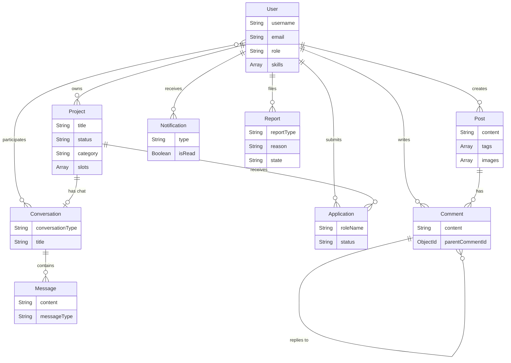

# DevSync — Backend


Geliştiricileri bir araya getiren, proje bazlı işbirliği ve gerçek zamanlı iletişim sunan bir platform.

## Teknolojiler

| Kategori | Teknoloji |
|----------|-----------|
| Runtime | Node.js |
| Framework | Express.js v5 |
| Veritabanı | MongoDB + Mongoose ODM |
| Gerçek Zamanlı | Socket.io |
| Kimlik Doğrulama | JWT (Access + Refresh Token), bcrypt |
| Dosya Yükleme | Multer |
| API Dokümantasyonu | Swagger (OpenAPI 3.0) |

## Mimari

- **MVC + Service Layer** — Controller, Model, Route ve Service katmanlarıyla sorumluluk ayrımı
- **JWT Dual Token** — Access & Refresh token rotasyonu, cookie tabanlı güvenli oturum yönetimi
- **RBAC** — `checkRole()` middleware ile rol bazlı yetkilendirme (user/admin)
- **Socket.io Event-Driven** — Chat ve bildirim handler'ları modüler yapıda, bağlantı bazlı JWT doğrulama
- **Polimorfik Bildirimler** — Tek model üzerinden çoklu bildirim tipi (like, comment, reply, application vb.)

## Öne Çıkan Özellikler

- **Proje Yönetimi** — Slot bazlı takım oluşturma, başvuru ve onay sistemi
- **Gerçek Zamanlı Mesajlaşma** — Direkt ve grup sohbetleri, proje bazlı konuşmalar
- **Sosyal Etkileşim** — Post paylaşımı, iç içe yorum sistemi, beğeni mekanizması
- **Canlı Bildirimler** — Socket üzerinden anlık bildirim iletimi
- **Kullanıcı Presence** — Online/offline durum takibi ve yayını
- **Raporlama** — İçerik ve kullanıcı raporlama, admin çözüm paneli
- **Dosya Yönetimi** — Avatar, post görselleri ve sohbet dosyaları için ayrı depolama

## Proje Yapısı

```
src/
├── config/          # DB, Multer, Swagger yapılandırmaları
├── controllers/     # İş mantığı (8 controller)
├── middlewares/      # Auth, RBAC, Socket auth
├── models/          # Mongoose şemaları (10 model)
├── routes/          # REST API endpoint'leri
├── services/        # Chat & Notification servisleri
├── socket/          # Socket.io sunucusu ve handler'lar
└── server.js
```

## Veritabanı Şeması - Temel Özellikler

> Detaylı veritabanı şeması ve model ilişkileri için [DATABASE.md](DATABASE.md) dosyasına bakın.



## Kurulum

```bash
npm install
npm start       # Sunucuyu başlat (nodemon)
```

`.env.example` dosyasını `.env` olarak kopyalayıp değerleri doldurun:

```bash
cp .env.example .env
```

API dokümantasyonuna `http://localhost:{PORT}/api-docs` adresinden ulaşılabilir.

---

## API Endpoints

### Auth (`/auth`)

| Metot | Endpoint | Açıklama |
|-------|----------|----------|
| POST | `/auth/register` | Yeni kullanıcı kaydı |
| GET | `/auth/verify-email/:token` | E-posta doğrulama |
| POST | `/auth/resend-verification` | Doğrulama maili tekrar gönder |
| POST | `/auth/login` | Giriş yap |
| POST | `/auth/token-refresh` | Access token yenile |
| POST | `/auth/logout` | Çıkış yap |
| POST | `/auth/avatar` | Profil fotoğrafı yükle |
| DELETE | `/auth/avatar` | Profil fotoğrafı sil |
| PUT | `/auth/profile` | Profil güncelle |
| GET | `/auth/profile/:id` | Kullanıcı profili getir |
| POST | `/auth/block/:userId` | Engelle / engeli kaldır |
| POST | `/auth/follow/:userId` | Takip et / bırak |
| GET | `/auth/following` | Takip edilenler |
| GET | `/auth/followers` | Takipçiler |
| GET | `/auth/users/search` | Kullanıcı ara |

### Posts (`/posts`)

| Metot | Endpoint | Açıklama |
|-------|----------|----------|
| GET | `/posts` | Gönderileri listele |
| POST | `/posts` | Yeni gönderi oluştur |
| GET | `/posts/user/:userId` | Kullanıcının gönderileri |
| GET | `/posts/:postId` | Gönderi detayı |
| PUT | `/posts/:postId` | Gönderi güncelle |
| DELETE | `/posts/:postId` | Gönderi sil |
| POST | `/posts/:postId/like` | Beğen / beğeniyi kaldır |

### Comments (`/comments`)

| Metot | Endpoint | Açıklama |
|-------|----------|----------|
| POST | `/comments` | Yorum yaz |
| GET | `/comments/post/:postId` | Gönderinin yorumları |
| PUT | `/comments/:commentId` | Yorum güncelle |
| DELETE | `/comments/:commentId` | Yorum sil |
| POST | `/comments/:commentId/like` | Yorum beğen / kaldır |

### Projects (`/projects`)

| Metot | Endpoint | Açıklama |
|-------|----------|----------|
| POST | `/projects` | Proje oluştur |
| GET | `/projects` | Projeleri listele |
| GET | `/projects/my-projects` | Kendi projelerim |
| GET | `/projects/:projectId` | Proje detayı |
| PUT | `/projects/:projectId` | Proje güncelle |
| DELETE | `/projects/:projectId` | Proje sil |
| POST | `/projects/:projectId/slots` | Slot ekle |
| PUT | `/projects/:projectId/slots/:slotId` | Slot güncelle |
| DELETE | `/projects/:projectId/slots/:slotId` | Slot sil |

### Applications (`/applications`)

| Metot | Endpoint | Açıklama |
|-------|----------|----------|
| POST | `/applications/apply` | Projeye başvur |
| GET | `/applications/my-applications` | Başvurularım |
| DELETE | `/applications/cancel/:applicationId` | Başvuru iptal |
| GET | `/applications/:projectId` | Proje başvurularını görüntüle |
| POST | `/applications/accept/:applicationId` | Başvuru kabul et |
| POST | `/applications/reject/:applicationId` | Başvuru reddet |

### Chat (`/chat`)

| Metot | Endpoint | Açıklama |
|-------|----------|----------|
| POST | `/chat/conversations` | Yeni konuşma oluştur |
| GET | `/chat/conversations` | Konuşmaları listele |
| GET | `/chat/conversations/archived` | Arşivlenen konuşmalar |
| POST | `/chat/conversations/sync-projects` | Proje konuşmalarını senkronize et |
| POST | `/chat/conversations/project/:projectId` | Proje konuşması getir/oluştur |
| POST | `/chat/conversations/:conversationId/members` | Grup üyesi ekle |
| DELETE | `/chat/conversations/:conversationId/members/:targetUserId` | Grup üyesi çıkar |
| GET | `/chat/conversations/:conversationId` | Konuşma detayı |
| DELETE | `/chat/conversations/:conversationId` | Konuşmayı arşivle |
| PATCH | `/chat/conversations/:conversationId/unarchive` | Arşivden çıkar |
| POST | `/chat/conversations/:conversationId/messages` | Mesaj gönder |
| GET | `/chat/conversations/:conversationId/messages` | Mesajları getir |
| POST | `/chat/conversations/:conversationId/read` | Okundu olarak işaretle |
| GET | `/chat/conversations/:conversationId/unread` | Okunmamış mesaj sayısı |
| PUT | `/chat/messages/:messageId` | Mesaj düzenle |
| DELETE | `/chat/messages/:messageId` | Mesaj sil |

### Notifications (`/notifications`)

| Metot | Endpoint | Açıklama |
|-------|----------|----------|
| GET | `/notifications` | Bildirimleri listele |
| GET | `/notifications/unread-count` | Okunmamış bildirim sayısı |
| PATCH | `/notifications/read-all` | Tümünü okundu işaretle |
| PATCH | `/notifications/:id/read` | Bildirimi okundu işaretle |

### Reports (`/reports`)

| Metot | Endpoint | Açıklama |
|-------|----------|----------|
| POST | `/reports` | Rapor oluştur |
| GET | `/reports/my-reports` | Raporlarım |
| POST | `/reports/cancel/:reportId` | Rapor iptal et |
| GET | `/reports/admin` | Tüm raporlar (admin) |
| GET | `/reports/:reportId` | Rapor detayı |
| PATCH | `/reports/resolve/:reportId` | Raporu çözümle (admin) |

### Admin (`/admin`)

| Metot | Endpoint | Açıklama |
|-------|----------|----------|
| GET | `/admin/stats` | Dashboard istatistikleri |
| GET | `/admin/users` | Kullanıcıları listele |
| GET | `/admin/users/:userId` | Kullanıcı detayı |
| PATCH | `/admin/users/:userId/status` | Kullanıcı durumu güncelle |
| PATCH | `/admin/users/:userId/role` | Kullanıcı rolü güncelle |
| GET | `/admin/posts` | Gönderileri listele |
| DELETE | `/admin/posts/:postId` | Gönderi sil |
| GET | `/admin/projects` | Projeleri listele |
| PATCH | `/admin/projects/:projectId/status` | Proje durumu güncelle |
| GET | `/admin/comments` | Yorumları listele |
| DELETE | `/admin/comments/:commentId` | Yorum sil |
